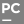

<h1 align="center">Hi 👋, I'm Soumallya Dev</h1>
<h3 align="center">A Pre-Final Year student studying Computer Science in India</h3>

  

- 🔭 I’m currently building **Healthic**

- 👨‍💻 All of my projects are available at [https://soumallyadev.live](https://soumallyadev.live)

<h3>
Connect with me:  
  

 
 
  
Programming Languages I work with:  

  
 
 

Tools I use:  

</h3>

 
 
 
 
 
 

<h3 align="left">Support:</h3>

  

&nbsp;

    :arrow_down: Scroll down to see my top repositories :arrow_down:
     
    <b>
      Show some ❤️ by starring some of the repositories!
    </b>

